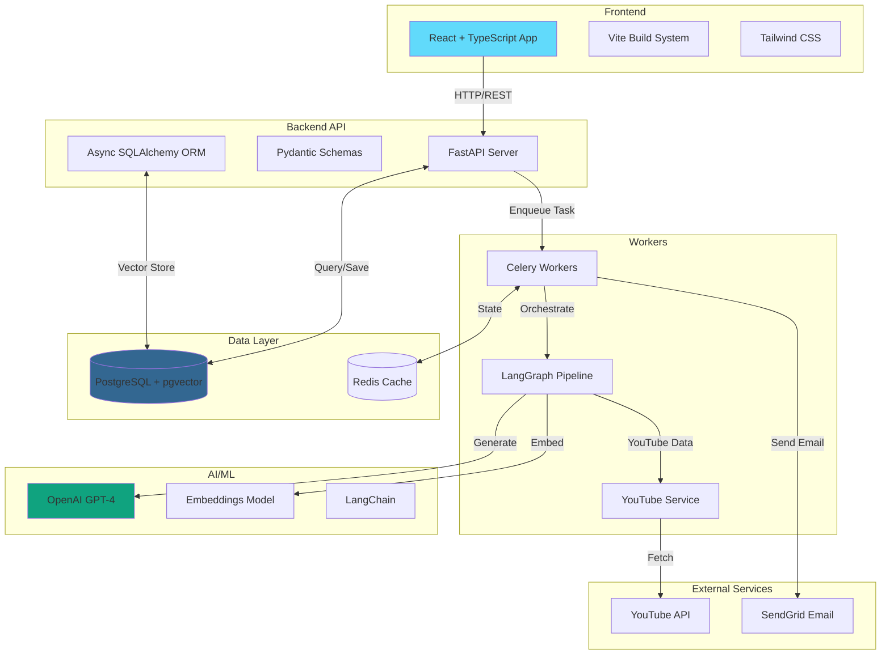

# 🎬 YouTube to Blog AI Agent - Resume Project

## 📋 Project Overview

A **production-ready full-stack application** that leverages **LangChain + LangGraph** to automatically generate beautiful, SEO-optimized blog posts from YouTube videos. Built with modern technologies and best practices for scalability, maintainability, and deployment.

### 🎯 Key Features

- **AI-Powered Blog Generation**: Uses GPT-4 and LangGraph state machines for intelligent content creation
- **Vector Search**: pgvector integration for semantic search and RAG capabilities
- **Asynchronous Processing**: Celery + Redis for background task management
- **Real-time Progress Tracking**: WebSocket-style polling for job status updates
- **Email Delivery**: SendGrid integration for sharing blog posts
- **Modern UI/UX**: React + TypeScript with Tailwind CSS
- **Production-Ready**: Docker, CI/CD, comprehensive testing

---

## 🏗️ Architecture

### System Architecture



### Data Flow

1. **User Input** → Frontend form (channel name + video title)
2. **API Request** → FastAPI creates job in PostgreSQL
3. **Task Queue** → Celery enqueues background task
4. **Video Search** → YouTube API finds video
5. **Transcript Fetch** → youtube-transcript-api extracts captions
6. **LangGraph Pipeline**:
   - Extract key points from transcript
   - Generate blog outline
   - Write individual sections
   - Polish and assemble final blog
7. **Embeddings** → OpenAI generates vectors, stored in pgvector
8. **Save** → Blog post saved to PostgreSQL
9. **Email** (optional) → SendGrid delivers blog to user

---

## 🛠️ Technology Stack

### Backend
- **Framework**: FastAPI 0.109+ (async Python web framework)
- **ORM**: SQLAlchemy 2.0+ with asyncpg driver
- **Task Queue**: Celery 5.3+ with Redis broker
- **AI Framework**: LangChain + LangGraph for LLM orchestration
- **LLM Provider**: OpenAI GPT-4 (gpt-4) + text-embedding-3-small
- **Database**: PostgreSQL 16 with pgvector extension
- **Cache**: Redis 7
- **Migrations**: Alembic
- **Validation**: Pydantic 2.0

### Frontend
- **Framework**: React 18 with TypeScript 5
- **Build Tool**: Vite 5
- **Styling**: Tailwind CSS 3
- **HTTP Client**: Axios
- **Markdown**: react-markdown with syntax highlighting
- **Icons**: lucide-react

### DevOps & Infrastructure
- **Containerization**: Docker + docker-compose
- **CI/CD**: GitHub Actions
- **Testing**: pytest (backend), vitest (frontend)
- **Linting**: ruff + black (Python), ESLint (TypeScript)
- **Monitoring**: Health check endpoints

---

## 📂 Project Structure

```
yt-videos-to-blog-creator-ai-agents/
├── backend/
│   ├── alembic/                    # Database migrations
│   │   ├── versions/
│   │   │   └── 001_initial_migration.py
│   │   └── env.py
│   ├── app/
│   │   ├── api/                    # API endpoints
│   │   │   ├── generate.py         # Blog generation
│   │   │   ├── status.py           # Job status tracking
│   │   │   ├── email.py            # Email delivery
│   │   │   └── health.py           # Health checks
│   │   ├── db/                     # Database layer
│   │   │   ├── crud.py             # CRUD operations
│   │   │   └── session.py          # Connection management
│   │   ├── models/                 # Data models
│   │   │   ├── database.py         # SQLAlchemy models
│   │   │   └── schemas.py          # Pydantic schemas
│   │   ├── services/               # Business logic
│   │   │   ├── youtube.py          # YouTube API integration
│   │   │   ├── llm_pipeline.py     # LangGraph workflow
│   │   │   ├── embeddings.py       # Vector operations
│   │   │   └── email.py            # Email service
│   │   ├── workers/                # Celery tasks
│   │   │   ├── celery_app.py       # Celery config
│   │   │   └── tasks.py            # Background tasks
│   │   ├── config.py               # Settings management
│   │   └── main.py                 # FastAPI app
│   ├── tests/                      # Backend tests
│   │   ├── conftest.py             # Pytest fixtures
│   │   ├── test_api.py
│   │   ├── test_database.py
│   │   └── test_services.py
│   ├── Dockerfile                  # Backend container
│   ├── requirements.txt            # Python dependencies
│   └── alembic.ini                 # Alembic configuration
├── frontend/
│   ├── src/
│   │   ├── api/
│   │   │   └── client.ts           # API client
│   │   ├── components/
│   │   │   ├── GeneratorForm.tsx   # Input form
│   │   │   └── BlogPost.tsx        # Result display
│   │   ├── tests/
│   │   │   ├── App.test.tsx
│   │   │   └── GeneratorForm.test.tsx
│   │   ├── App.tsx                 # Main component
│   │   └── main.tsx                # Entry point
│   ├── Dockerfile                  # Frontend container
│   ├── package.json
│   ├── vite.config.ts
│   ├── vitest.config.ts
│   └── tailwind.config.js
├── .github/
│   └── workflows/
│       └── ci.yml                  # CI/CD pipeline
├── docker-compose.yml              # Multi-service orchestration
├── README.md                       # Project documentation
└── RESUME.md                       # This file
```

---

## 🚀 Key Features & Implementation

### 1. LangGraph Pipeline (State Machine)

**File**: `backend/app/services/llm_pipeline.py`

The blog generation uses a **LangGraph state machine** with 4 stages:

```python
extract_key_points → generate_outline → write_sections → assemble_polish
```

**State Definition**:
```python
class BlogGenerationState(TypedDict):
    video_id: str
    video_title: str
    transcript: str
    key_points: List[str]
    outline: str
    sections: List[Dict[str, str]]
    final_blog: str
    error: str
```

**Advantages**:
- **Deterministic flow**: Clear state transitions
- **Error handling**: Error states for graceful failures
- **Observability**: Each node emits progress updates
- **Modularity**: Easy to add/modify pipeline stages

### 2. Vector Embeddings & RAG

**File**: `backend/app/services/embeddings.py`

- Splits blog content into chunks (1000 chars, 200 overlap)
- Generates OpenAI embeddings (text-embedding-3-small, 1536 dimensions)
- Stores in PostgreSQL with pgvector extension
- Enables semantic search across all blogs

**Similarity Search**:
```python
# Uses cosine distance for vector similarity
SELECT chunk_text, blog_title, 
       cosine_distance(embedding, query_vector) as distance
FROM embeddings
ORDER BY distance
LIMIT 5;
```

### 3. Asynchronous Task Processing

**File**: `backend/app/workers/tasks.py`

- Celery workers handle long-running blog generation
- Redis broker for task queue and result backend
- Progress updates (0-100%) sent to frontend
- Graceful error handling with job status tracking

**Task Flow**:
```python
1. Create job (PENDING)
2. Search YouTube (15% progress)
3. Fetch transcript (30%)
4. Generate blog (60%)
5. Save to DB (80%)
6. Create embeddings (90%)
7. Mark complete (100%)
```

### 4. Real-time Frontend Updates

**File**: `frontend/src/components/GeneratorForm.tsx`

- Polls `/status/{job_id}` every 2 seconds
- Displays progress bar
- Shows current step status
- Automatically stops polling on completion/failure

### 5. Database Design

**Tables**:
1. **jobs**: Track generation jobs
   - Fields: id (UUID), channel_name, video_title, status, progress, error_message
   - Indexed on: id, status

2. **blog_posts**: Store generated blogs
   - Fields: id, job_id (FK), title, content (TEXT), metadata (JSONB)
   - Indexed on: id, job_id

3. **embeddings**: Vector storage
   - Fields: id, blog_post_id (FK), chunk_text, embedding (vector(1536))
   - Indexed on: blog_post_id

---

## 🔧 Setup & Installation

### Prerequisites
- Docker & Docker Compose
- Python 3.11+ (for local dev)
- Node.js 20+ (for local dev)
- OpenAI API Key
- YouTube Data API Key (optional)
- SendGrid API Key (optional)

### Quick Start with Docker

1. **Clone the repository**
```bash
git clone <repository-url>
cd yt-videos-to-blog-creator-ai-agents
```

2. **Create environment files**
```bash
# Backend .env
cd backend
cp .env.example .env
# Edit .env with your API keys
```

3. **Start all services**
```bash
docker-compose up --build
```

Services will be available at:
- Frontend: http://localhost:3000
- Backend API: http://localhost:8000
- API Docs: http://localhost:8000/docs

### Local Development

**Backend**:
```bash
cd backend
python -m venv venv
source venv/bin/activate  # Windows: venv\Scripts\activate
pip install -r requirements.txt
uvicorn app.main:app --reload
```

**Frontend**:
```bash
cd frontend
npm install
npm run dev
```

**Database Setup**:
```bash
cd backend
alembic upgrade head
```

---

## 🧪 Testing

### Backend Tests
```bash
cd backend
pytest tests/ -v --cov=app --cov-report=term
```

Coverage includes:
- API endpoint tests
- Database CRUD tests
- Service layer tests (YouTube, LLM, embeddings)

### Frontend Tests
```bash
cd frontend
npm run test
npm run test:coverage
```

Coverage includes:
- Component rendering tests
- User interaction tests
- API client mocking

---

## 📊 CI/CD Pipeline

**File**: `.github/workflows/ci.yml`

### Pipeline Stages

1. **Backend Tests**
   - Linting (ruff + black)
   - Unit tests with pytest
   - Coverage reporting (Codecov)
   - PostgreSQL + Redis services

2. **Frontend Tests**
   - ESLint + TypeScript checks
   - Vitest unit tests
   - Build validation

3. **Docker Build**
   - Multi-stage builds
   - Push to Docker Hub
   - Cache optimization

4. **Deploy** (optional)
   - Can deploy to Cloud Run, ECS, or any container platform

---

## 🎯 Future Enhancements

### Phase 2 (Planned)
- [ ] Multi-video blog generation (series/playlist)
- [ ] Custom blog templates
- [ ] SEO optimization suggestions
- [ ] Social media post generation
- [ ] Blog scheduling/publishing integrations

### Phase 3 (Advanced)
- [ ] WebSocket for real-time updates
- [ ] User authentication & saved blogs
- [ ] Blog editing interface
- [ ] Analytics dashboard
- [ ] Multi-language support

---

## 💼 Resume Highlights

### Technical Skills Demonstrated

**Backend Development**:
- ✅ FastAPI async web framework
- ✅ SQLAlchemy ORM with PostgreSQL
- ✅ Celery distributed task queue
- ✅ RESTful API design
- ✅ Database migrations (Alembic)

**AI/ML Engineering**:
- ✅ LangChain + LangGraph orchestration
- ✅ OpenAI GPT-4 integration
- ✅ Vector embeddings & RAG
- ✅ Prompt engineering
- ✅ LLM workflow design

**Frontend Development**:
- ✅ React + TypeScript
- ✅ Modern UI/UX (Tailwind CSS)
- ✅ State management
- ✅ API integration
- ✅ Responsive design

**DevOps & Infrastructure**:
- ✅ Docker containerization
- ✅ docker-compose orchestration
- ✅ CI/CD with GitHub Actions
- ✅ Database optimization (indexes, pgvector)
- ✅ Async programming patterns

**Software Engineering**:
- ✅ Clean architecture (separation of concerns)
- ✅ SOLID principles
- ✅ Comprehensive testing (pytest, vitest)
- ✅ Error handling & logging
- ✅ API documentation (OpenAPI/Swagger)

---

## 📝 API Documentation

### Endpoints

**POST /api/v1/generate**
- Generate blog post from YouTube video
- Request: `{ "channel_name": "...", "video_title": "...", "email": "..." }`
- Response: `{ "job_id": "...", "status": "..." }`

**GET /api/v1/status/{job_id}**
- Get job status and result
- Response: Includes progress, status, and blog_post (if complete)

**POST /api/v1/email/send-email**
- Email a blog post
- Request: `{ "blog_post_id": 1, "email": "user@example.com" }`

**GET /api/v1/health**
- Health check endpoint

Full API docs available at `/docs` (Swagger UI)

---

## 📄 License

MIT License - See LICENSE file

---

## 🙏 Acknowledgments

- **LangChain**: AI orchestration framework
- **OpenAI**: GPT-4 and embeddings API
- **FastAPI**: High-performance Python web framework
- **pgvector**: Vector similarity search for PostgreSQL

---

## 📧 Contact

**Project by**: [Your Name]
**Email**: your.email@example.com
**GitHub**: github.com/yourusername
**LinkedIn**: linkedin.com/in/yourprofile

---

**Built with ❤️ for showcasing modern full-stack AI development skills**
